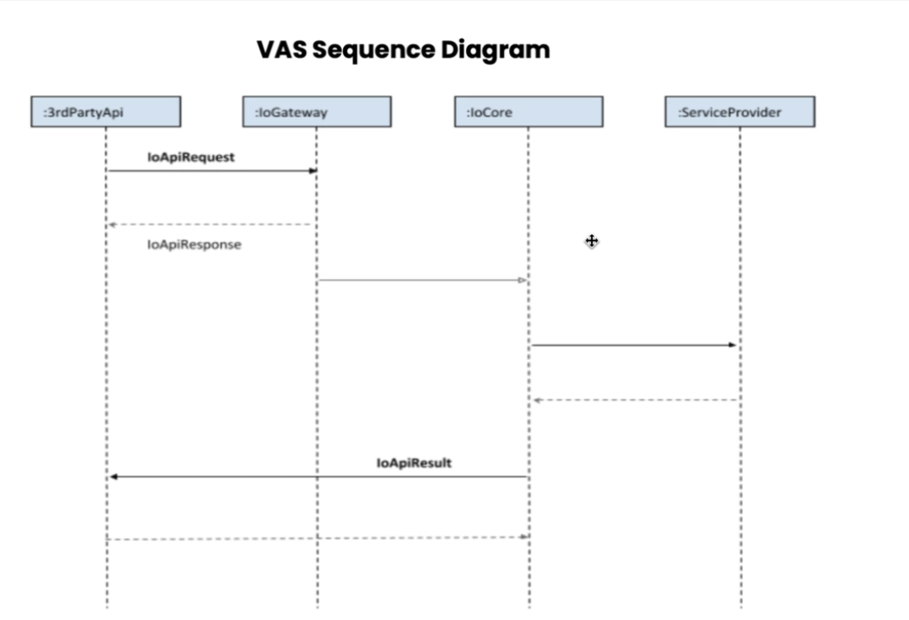

- [[Wasoko]]
	- [[Meeting]] #Standup
		- [[Mahesh]] - working on the auth for payments api
		- [[Chris]] - working profile
	- [[Meeting]] #project-spider-standup
		- Deployment Plan
	- [[Meeting]] #Tanda
		- Tanda - Kenya and Uganda
			- 8% East of Africa - 35K Agents
			- Uganda it is piloted
		- has to do KYC for customers
		- Customer will have credentials once the KYC
		- We need to connect with Tanda API to perform any operations
		- Wasoko will have a dashboard
		- {:height 497, :width 716}
		- Agents can login in both apps - app login can be blocked if required