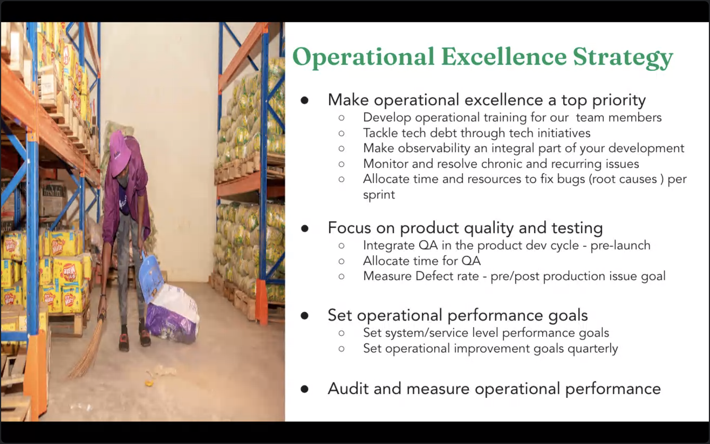
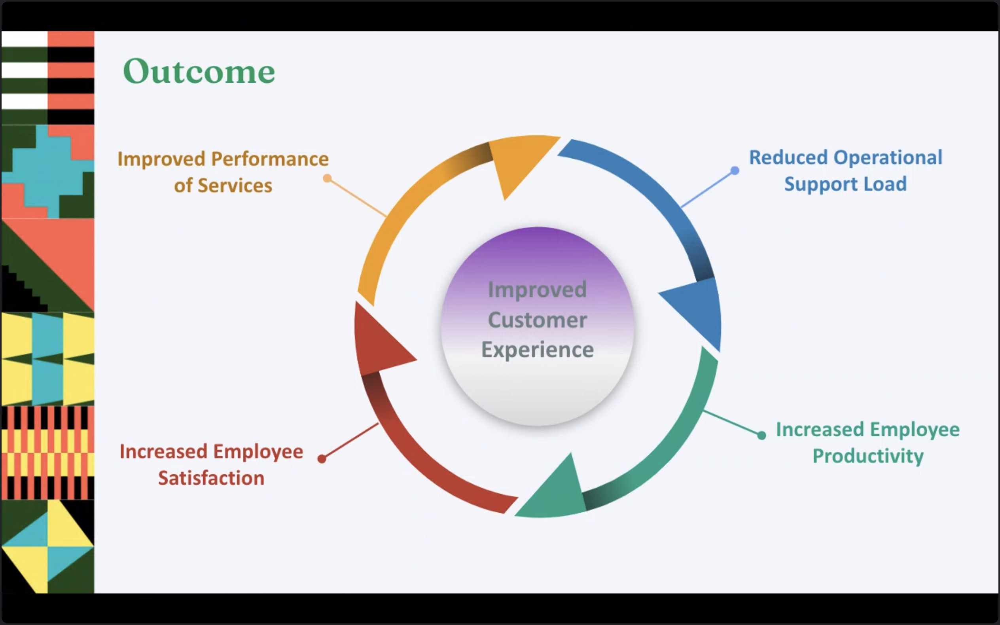
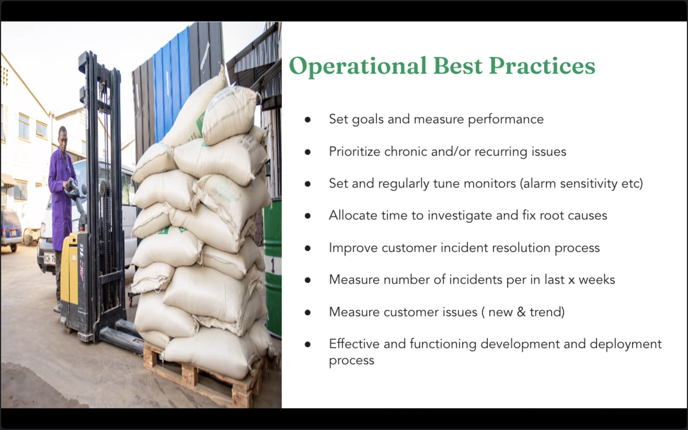
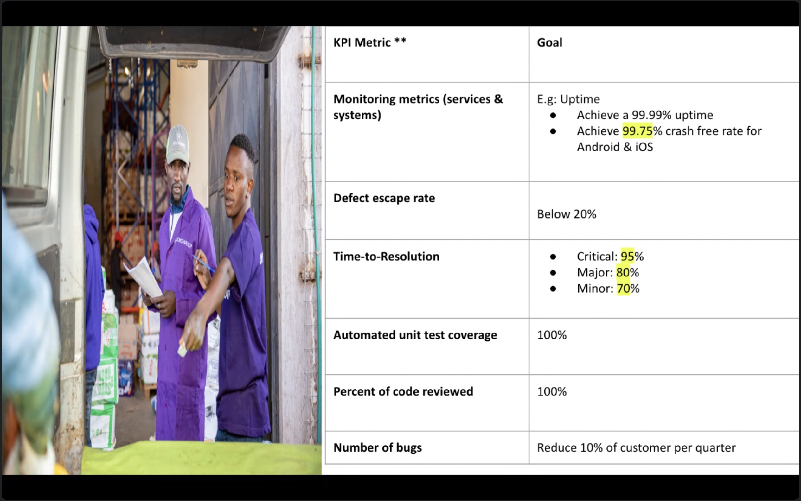
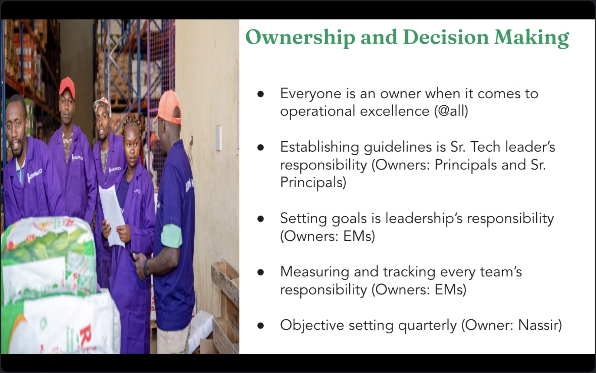

- ## Strachpad
## Learnings
## Todos
	- TODO setup to create invoices every 48 hours once
	- TODO stores for the GCP alerts and notifications
## Meetings
	- #florence [[1:1]]
		- good in pointing out issues in SKIP KYC
		- Bug work flow ?
		- JIRA tickets are not updated properly
		-
	- #alok [[1:1]]
		- 7 yrs of experience
		- Was in razorpay
		- Automation / Manual
		- love to work frontend testing
		- will not work after 8pm
		- Working well
			- Team and people are good
		- Working not well
			- Work life balance
			- automation - we are able to reach the goal - because of our testing features and other priorities.
			- Estimation is wrong - for both devs and QA, since we are getting the build late we are not having enough time to test and creating bugs
			-
	- #collins [[1:1]]
		- Jobs
			- some jobs failed - if job is not used
		- working #thani to ensure we are able to deploy all jobs
	- [[Tech leaders Weekly]]
		- 4 meetings to discuss
			- road map
			- tech OKRs
			- priority review
			- and Technical challenges
		- Pillars
			- Customer obession
				- exceed customer expectation
				- customer centric culture
				- quality, available and functional systems
				- excellent customer support
			- Execution Excellence
				- clear goals
				- ruthless prioritise
				- operational excellence and effective process
				- KPIs
			- Courage
				- standup for values and principles
				- speaking up - do the right thing for the customers
				- taking risks
				- tough decisions and ownership
			- Innovation
				- innovation culture
				- innovate and evolve
				- innovative products and services to customers
			- operational excellence'
				- 
				- 
				- 
				- 
				- 